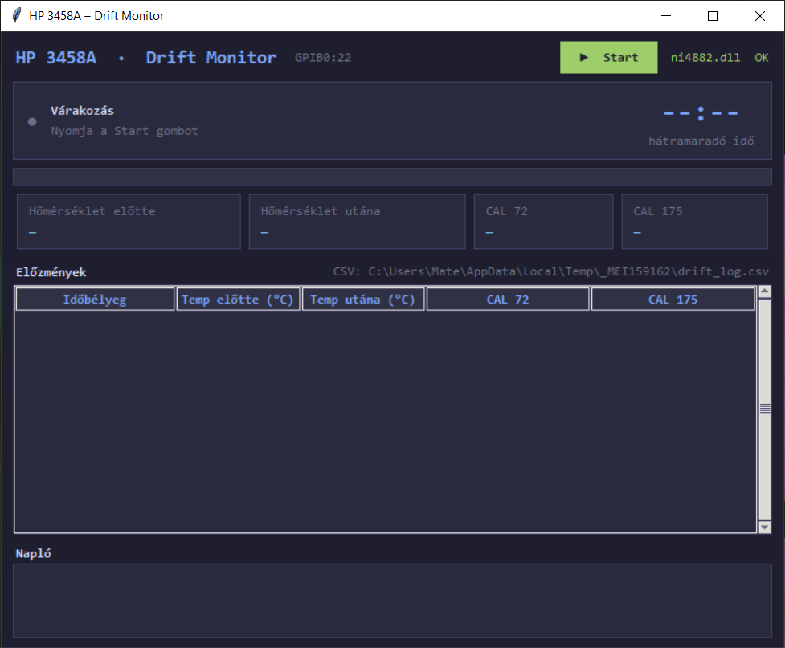

# HP3458A_Drift_Monitor – HP 3458A drift megfigyelő

A program a HP 3458A digitális multiméter **A3 ADC board-ján elhelyezett U180 jelű IC**
hosszú távú stabilitásának vizsgálatára szolgál. Óránkénti ACAL DCV kalibrációs ciklust
hajt végre, és ACAL során rögzíti a hőmérsékletet és a CAL72 kalibrációs értéket.
Az így kapott idősorozatból következtetni lehet a műszer driftjének mértékére
és annak hőmérséklet-függésére.



## Mérési ciklus (óránként)

```
TEMP? → ACAL DCV → 5 perc várakozás → CALVAL?72 + CALVAL?175 + TEMP? → CSV
```

| Mért adat | Leírás |
|-----------|--------|
| TEMP? | Belső hőmérséklet |
| ACAL DCV | Automatikus DC feszültség kalibráció |
| CALVAL?72 | Kalibrációs érték |
| CALVAL?175 | Az ACAL során rögzített hőmérséklet |

## Kapcsolódás

| Eszköz | Kapcsolat |
|--------|-----------|
| HP 3458A DMM | GPIB (NI-488.2, gpib0) |

## Követelmények

- Windows 10 or later
- NI GPIB-USB-HS adapter (National Instruments)
- NI-488.2 driver telepítve (ni.com/drivers)
- Python 3.11+
- PyVISA **nem** szükséges — a program közvetlenül a NI-488.2 DLL-en keresztül kommunikál az adapterrel

## Build (önálló exe)

```bat
build.bat
```

Kimenet: `dist\HP3458A_DriftMonitor.exe`
